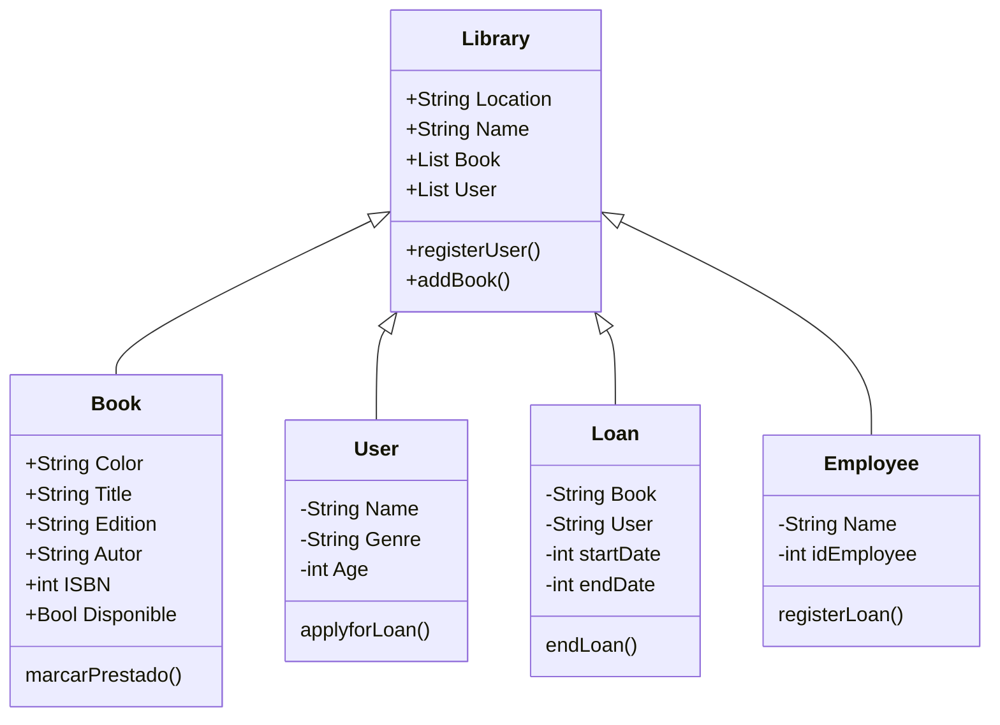

# Reto 2 POO
Diagrama de UML de un sistema de gestión de una biblioteca:

```mermaid
classDiagram
    Library <|-- Book
    Library <|-- User
    Library <|-- Loan
    Library <|-- Employee
    Library : +String Location
    Library : +String Name
    Library : +List Book
    Library : +List User
    Library: +registerUser()
    Library: +addBook()
    class Book{
      +String Color
      +String Title
      +String Edition
      +String Autor
      +int ISBN
      +Bool Disponible
      marcarPrestado()
    }
    class User{
        -String Name
        -String Genre
        -int Age
        applyforLoan()
    }
    class Loan{
        -String Book
        -String User
        -int startDate
        -int endDate
        endLoan()
    }
    class Employee{
        -String Name
        -int idEmployee
        registerLoan()
    }
```
